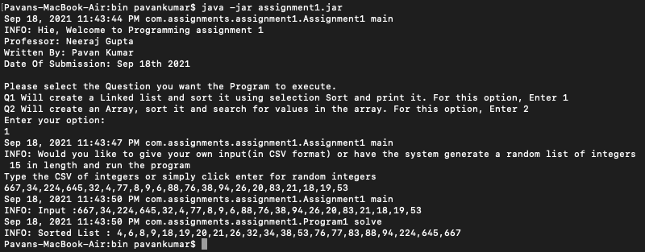
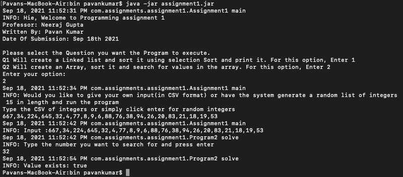
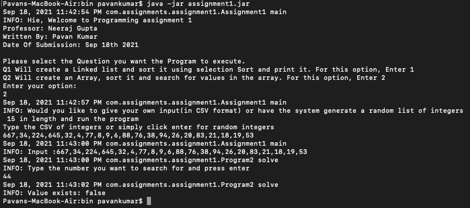

# Assignment 1 - Due on Sept 19th 2021

Github link : 

## Requirements
- JDK 8 and above installed

## Zip file
As part of the submission, a zip file will be provided which will have 3 items
- Assignment folder: It's a java project which contains the code . Note: you can also go to the above Github link and look at the code.
- assignment1.jar: It's the executable file to run the program. Instructions to run it are provided below in the Execution Instruction section

## Build Program
Note: the executable jar is already provided as part of the assignment submission so the jar can be downloaded and this part can be skipped.

- Download the source folder submitted or download it from the github link.
- Open terminal and change directory to the root folder
- Create a binary folder to store the .class file

> mkdir bin

- Compile the .java files using the following command

> javac src/com/assignments/assignment1/*.java -d bin/

- change directory to bin folder

> cd bin/

- Create a Executable jar file using the .class files

> jar cfe assignment1.jar com/assignments/assignment1/Assignment1 com/assignments/assignment1/*.class

now the executable assignment1.jar is ready to use.

## Execution Instruction
To run the program, enter the following command in terminal where the executable jar is located

> java -jar assignment1.jar

The program starts and will guide the user through the process. Lets look at it in detail below

## Welcome Section
The Welcome section as shown in the image will ask you to enter either 1 or 2 to choose the question to solve
1 -> Question 1
2 -> Question 2

## Question 1
To solve the question, we need input from the user. A data set of integer in csv format (example: 1,2,3,4,5). There is also a provision to generate a set of 15 random numbers. To utilize the random csv generation, just click enter without typing any data.

Once the csv has been provided, the program runs selection sort on the linked list and returns the output on the console.

Figure 1: The above image executes program 1 with user inputed data.

Figure 2: The above image executes program 1 with the random CSV generation functionality

## Question 2
Again to solve the question, we need input from the user. A data set of integer in csv format (example: 1,2,3,4,5). There is also a provision to generate a set of 15 random numbers. To utilize the random csv generation, just click enter without typing any data.

Once the csv has been provided, the program runs bubble sort on the array. Then it performs ternary sort to find if the provided no is present. The output here is a boolean value

Figure 3: The above image executes program 2 with user inputed data. Here the no 32 is searched for and found in the list

Figure 4: The above image executes program 2 with user inputed data. Here the no 44 is searched for and not found in the list

Figure 5:  The above image executes program 2 with random generated input data. Here the no 21 is searched for and found in the list

Figure 6: The above image executes program 2 with random generated input data. Here the no 44 is searched for and found in the list

