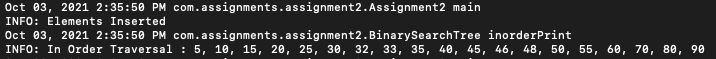
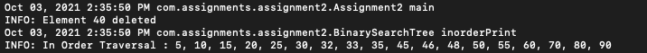
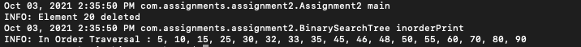

# Assignment 2 - Due on Oct 3rd 2021

Github link : https://github.com/kpavan95/CS5343/blob/main/src/com/assignments/assignment2/

## Requirements
- JDK 8 and above installed

## Zip file
As part of the submission, a zip file will be provided which will have 3 items
- Assignment folder: It's a java project which contains the code . Note: you can also go to the above Github link and look at the code.
- assignment2.jar: It's the executable file to run the program. Instructions to run it are provided below in the Execution Instruction section
- This readme file in pdf format

## Build Program
Note: the executable jar is already provided as part of the assignment submission so the jar can be downloaded and this part can be skipped.

- Download the source folder submitted or download it from the github link.
- Open terminal and change directory to the root folder
- Create a binary folder to store the .class file

> mkdir bin

- Compile the .java files using the following command

> javac src/com/assignments/assignment2/*.java -d bin/

- change directory to bin folder

> cd bin/

- Create a Executable jar file using the .class files

> jar cfe assignment2.jar com/assignments/assignment2/Assignment2 com/assignments/assignment2/*.class

now the executable assignment2.jar is ready to use.

## Execution Instruction
To run the program, enter the following command in terminal where the executable jar is located

> java -jar assignment2.jar

The screenshot below shows the inorder traversal of the tree after each iteration.

Figure 1: The Binary search tree is initiated and the data that was given in the assignment is inserted

Figure 2: Element 40 is deleted from the Binary search

Figure 3: Element 20 is deleted from the Binary search