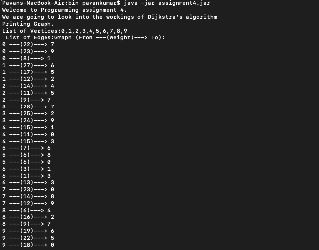
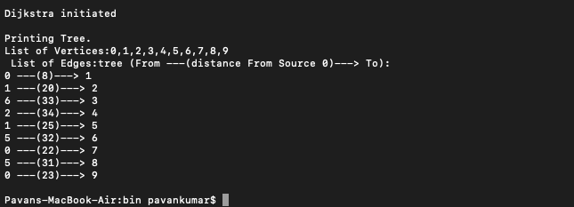

# Assignment 4 - Due on Nov 7th 2021

Github link : https://github.com/kpavan95/CS5343/tree/main/src/com/assignments/assignment4/

## Requirements
- JDK 8 and above installed

## Zip file
As part of the submission, a zip file will be provided which will have 3 items
- Assignment folder: It's a java project which contains the code . Note: you can also go to the above Github link and look at the code.
- assignment4.jar: It's the executable file to run the program. Instructions to run it are provided below in the Execution Instruction section
- This readme file in pdf format

## Build Program
Note: the executable jar is already provided as part of the assignment submission so the jar can be downloaded and this part can be skipped.

- Download the source folder submitted or download it from the github link.
- Open terminal and change directory to the root folder
- Create a binary folder to store the .class file

> mkdir bin

- Compile the .java files using the following command

> javac src/com/assignments/assignment4/*.java -d bin/

- change directory to bin folder

> cd bin/

- Create a Executable jar file using the .class files

> jar cfe assignment4.jar com/assignments/assignment4/Assignment4 com/assignments/assignment4/*.class

now the executable assignment4.jar is ready to use.

## Execution Instruction
To run the program, enter the following command in terminal where the executable jar is located

> java -jar assignment4.jar

The screenshot below shows the program's execution in different stages

Figure 1: Randomly generated Graph

Figure 2: Tree Generated using Dijkstra's algorithm
