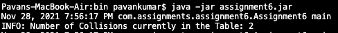
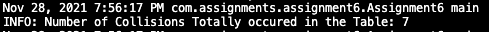
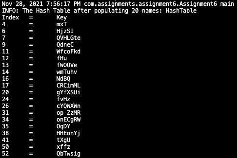

# Assignment 6 - Due on Nov 28th 2021

Github link : https://github.com/kpavan95/CS5343/blob/main/src/com/assignments/assignment6/

## Requirements
- JDK 8 and above installed

## Zip file
As part of the submission, a zip file will be provided which will have 3 items
- Assignment folder: It's a java project which contains the code . Note: you can also go to the above Github link and look at the code.
- assignment5.jar: It's the executable file to run the program. Instructions to run it are provided below in the Execution Instruction section
- This readme file in pdf format

## Build Program
Note: the executable jar is already provided as part of the assignment submission so the jar can be downloaded and this part can be skipped.

- Download the source folder submitted or download it from the github link.
- Open terminal and change directory to the root folder
- Create a binary folder to store the .class file

> mkdir bin

- Compile the .java files using the following command

> javac src/com/assignments/assignment6/*.java -d bin/

- change directory to bin folder

> cd bin/

- Create a Executable jar file using the .class files

> jar cfe assignment6.jar com/assignments/assignment6/Assignment6 com/assignments/assignment6/*.class

now the executable assignment6.jar is ready to use.

## Execution Instruction
To run the program, enter the following command in terminal where the executable jar is located

> java -jar assignment6.jar

The program starts and will guide the user through the process. Lets look at it in detail below

The screenshot below shows the program's execution in different stages

Figure 1: Current Collisions

Figure 2: Total Collisions

Figure 3: HashTable